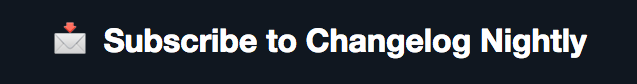

# Changelog Nightly

Changelog Nightly is a free email we ship every night at 10pm US Central. It unearths the hottest new repos on GitHub before they blow up.

Here's a preview:

[][nightly]

Want something opinionated and less frequent? Subscribe to [Changelog News][news]!

## Props and thanks

This project would not be possible without [Ilya Grigorik][igvita] and the work he put in to [GitHub Archive][gh-archive]. Thanks for all you do, Ilya!

[Listen to our in-depth interview with Ilya on The Changelog #144][144] where we cover all the details about GitHub Archive and Changelog Nightly.

## Contributing

[See here.][contributing]

## Hacking

1. Sign up for Google BigQuery and get an API key
2. Copy `.env.example` to `.env` and configure for your environment
3. run `rake -T` to see all the possible commands

## License

[MIT][license]

[nightly]: https://changelog.com/nightly
[news]: https://changelog.com/news
[igvita]: http://igvita.com
[gh-archive]: https://www.githubarchive.org
[144]: https://changelog.com/144
[contributing]: https://github.com/thechangelog/nightly/blob/master/CONTRIBUTING.md
[license]: https://github.com/thechangelog/nightly/blob/master/LICENSE
